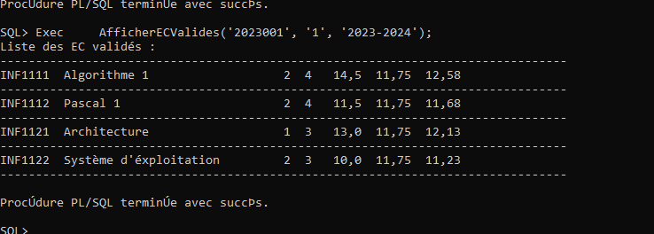
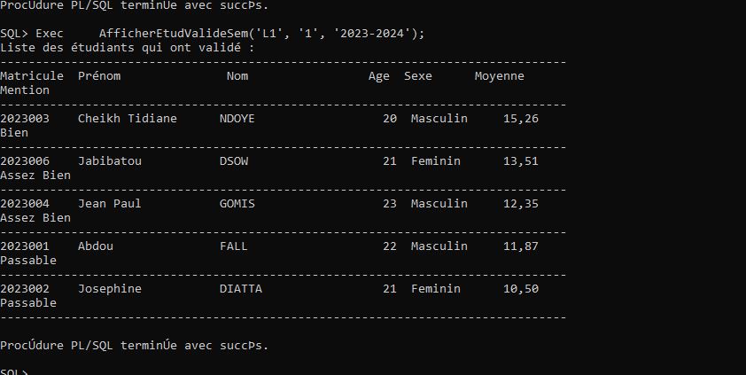
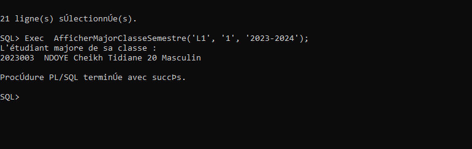
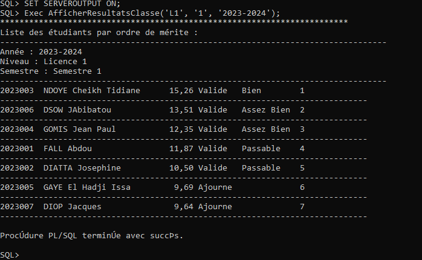
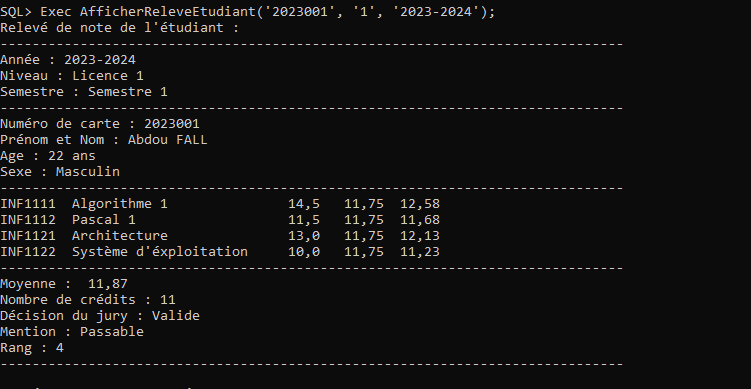

# Base de données avancée - Travaux Pratiques

## Informations du cours

**Professeur :** Dr Serigne DIAGNE  
**Département :** Informatique – UFR ST – UASZ  
**Année universitaire :** 2023 – 2024  
**Niveau :** Master Informatique - Première année  
**Semestre :** Premier semestre

## Étudiants

- **Abdou GAYE** - Matricule : 202001614
- **Aliou DIOP** - Matricule : 202000033

**Classe :** Master 1 UASZ

## Description du projet

Ce projet consiste en la création et la gestion d'une base de données Oracle pour le système de délibération académique. Il comprend la création des tables, l'insertion des données, ainsi que l'implémentation de triggers, procédures et fonctions en PL/SQL.

## Schéma de la base de données

Le système de délibération comprend les tables suivantes :

- **Etudiant** (Matricule, Nom, Prenom, Age, Sexe, Email, Niveau)
- **Semestre** (Numero, Cycle, Annee)
- **UE** (Code, Libelle, Coefficient, Credit, #Semestre, #Cycle)
- **EC** (Code, Libelle, Coefficient, Credit, #UE)
- **Note** (#Etudiant, #EC, Annee, Controle, Examen, Moyenne)
- **Resultat** (#Etudiant, #Semestre, #Cycle, Annee, Moyenne, Resultat, Mention, Rang)

## Captures d'écran des fonctionnalités

### 1. Liste des EC validés par un étudiant

_Affichage des Éléments Constitutifs (EC) validés par un étudiant donné pour un semestre spécifique._

### 2. Liste des étudiants ayant validé un semestre

_Liste des étudiants d'une classe donnée qui ont validé un semestre donné._

### 3. Major de la classe

_Identification du major (premier de la classe) pour un semestre donné._

### 4. Classement par ordre de mérite

_Classement des étudiants d'une classe par ordre de mérite pour un semestre donné._

### 5. Relevé de notes d'un étudiant

_Relevé de notes complet d'un étudiant pour un semestre donné._

## Structure du projet

### Partie 1 : SQL

- Création de la base de données "Deliberation"
- Gestion des utilisateurs et privilèges
- Création des tables avec domaines appropriés
- Insertion des données de test

### Partie 2 : PL/SQL

- **Triggers** : Automatisation des processus (génération matricules, validation données, calcul moyennes)
- **Procédures** : Gestion des calculs de moyennes, affichage des résultats, classements
- **Fonctions** : Calculs spécifiques (moyennes UE, moyennes semestrielles, moyennes de classe)

## Fonctionnalités implémentées

### Triggers

- Attribution automatique des matricules étudiants
- Validation du sexe (Masculin/Féminin)
- Génération automatique des adresses e-mail
- Attribution automatique des codes UE et EC
- Calcul automatique des moyennes EC
- Validation des résultats (Validé/Ajourné)

### Procédures

- Calcul des moyennes semestrielles
- Affichage des résultats par ordre de mérite
- Classement des étudiants
- Génération des relevés individuels
- Liste des EC validés par étudiant
- Liste des étudiants ayant validé
- Identification du major de classe

### Fonctions

- Calcul de moyenne par UE
- Calcul de moyenne semestrielle
- Calcul de moyenne de classe (semestre, EC, UE)

## Données de test

Le système contient des données pour l'année universitaire 2023-2024 :

- **15 étudiants** répartis en 3 niveaux (L1, L2, L3)
- **3 semestres** impairs du cycle licence
- **6 UE** et **12 EC** au total
- **120 notes** (contrôle et examen)
- **15 résultats** finaux

## Utilisation

La base de données est configurée avec deux types d'utilisateurs :

- **gerant** : Privilèges d'administrateur
- **employe** : Privilèges limités (calcul moyennes, rangs, affichage résultats)

---

**Université Assane SECK de Ziguinchor**  
**UFR Sciences et Technologies**  
**Département Informatique**
